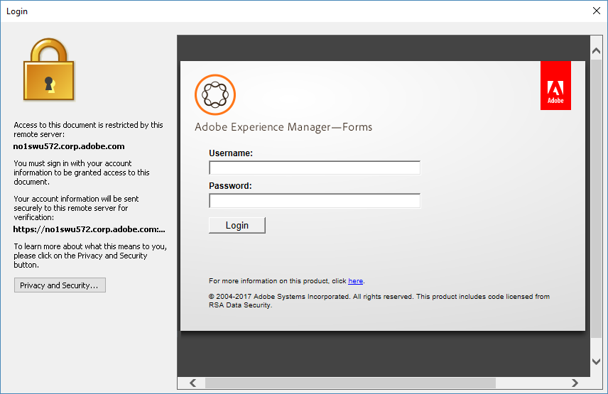

# Microsoft Office® 用 AEM Document Security 拡張機能を使用する{#using-aem-document-security-extension-for-microsoft-office}

## AEM Document Security Extension を使用したファイルの保護 {#usingaemdocumentsecurityextensiontoprotectfiles}

広範囲にファイルを配布する場合でも、ポリシーで保護されたファイルを受信者が使用する方法を制御できます。

Document Security Extension for Microsoft® Office を使用すると、次のタスクを実行できます。

* Document Security への接続の設定
* ファイルへのポリシーの適用
* Document Security web ページでのユーザーポリシーの作成と管理
* ポリシー保護のファイルからの削除
* ファイルに適用されているポリシーの変更
* Document Security web ページでのファイルアクセスの無効化やファイルポリシーの変更
* Document Security web ページでのファイルの監査履歴の表示

### Document Security サーバーへの接続 {#connect-to-a-document-security-server}

ファイルにポリシーを適用する場合は、Document Security の接続を設定する必要があります。Document Security Extension for Microsoft® Office のインストール方法によっては、既にデフォルトの接続設定が存在する場合があります。Document Security の 1 つ以上のインスタンスに対して接続設定を追加できます。Document Security 管理者からサーバー情報を取得できます。

ファイルの保護や保護ファイルの管理に使用したいサーバーをデフォルトサーバーとして設定します。新しいファイルにポリシーを適用する際や Document Security web ページを開く際、Document Security Extension for Microsoft® Office はデフォルトサーバーに接続します。Document Security の複数のインスタンスを使用してファイルを保護する場合は、サーバーを切り替える際にデフォルトサーバーの設定を変更する必要があります。ファイルを開く権限があれば、Document Security のインスタンスで保護されているファイルは開くことができます。

Document Security サーバーで証明書ベースの認証を使用する場合は、受け取った証明書をローカルマシンにインストールする必要があります。証明書認証を選択し、認証に使用する証明書を指定する必要があります。

1 つの Microsoft® Office アプリケーションで Document Security のインスタンスの接続設定を指定すると、その設定は Word、Excel、PowerPoint のすべてに指定されます。

#### クライアント側の証明書のインストール {#install-the-client-side-certificate}

証明書認証または双方向認証を通じて Document Security Web ページにアクセスする必要がある場合は、証明書を受け取り、それをローカルマシンにインストールする必要があります。 証明書ファイル（.PFX または .P12 ファイル）とそのパスワードを受け取ります。

1. 証明書ファイルをローカルマシンに保存します。
1. 証明書ファイルをダブルクリックして証明書インポートウィザードを開き、「**次へ**」をクリックします。
1. 証明書ファイルがファイル名ボックスに表示されている場合は、「**次へ**」をクリックします。別の証明書を指定する場合は、「**参照**」をクリックします。
1. 受け取ったパスワードを入力し、「**次へ**」をクリックします。
1. 証明書ストアダイアログで、「証明書をすべて次のストアに配置する」を選択し、「**参照**」をクリックします。
1. 証明書ストアの選択ダイアログで、「個人」を選択して「**OK**」をクリックします。そのあと「**次へ**」をクリックし、「**完了**」をクリックします。

#### 接続の設定 {#configure-connection-settings}

1. Microsoft Office® 2010 および Office 2013 用 Document Security 拡張機能、「**Document Security**」タブの「**サーバーを選択**」を選択します。
1. 「**新規**」をクリックして接続設定を作成するか、既存の接続を選択して「**編集**」をクリックします。
1. 「**名前**」ボックスに接続の名前を入力します。任意の名前を使用できます。
1. 「**サーバーのアドレス**」ボックスにサーバーのアドレスを入力します。
1. 「**ポート**」ボックスにサーバーポートを入力します。
1. （オプション）ユーザー名とパスワードを記憶する場合は、「**このコンピューターにパスワードを保存**」を選択し、該当するボックスにユーザー名とパスワードを入力します。他のユーザーがこのコンピューターにアクセスする可能性がある場合は、このオプションを選択しないことをお勧めします。
1. 「**このサーバーに接続**」をクリックします。Microsoft Office® 用 Document Security 拡張機能は、指定されたサーバーへの接続を試みます。 指定した認証タイプに応じて、次のいずれかの操作を行います。

   **ユーザー名とパスワード**

   Document Security 管理者から受け取ったユーザー名とパスワードを入力します。

   **証明書認証**

   受け取って個人用証明書ストアにインストールした証明書を選択する場合は、このオプションを選択します。

   Document Security で認証タイプを 1 つだけ設定した場合は、そのオプションだけが表示されます。

>[!NOTE]
>
>サーバーに接続できない場合は、Document Security web ページを Internet Explorer で開いてみてください。Internet Explorer でもサーバーに接続できない場合や、サーバーの証明書に関する警告がダイアログボックスに表示される場合、Document Security Extension for Microsoft® Office はサーバーに接続できません。サーバー管理者に問い合わせてください。

>[!NOTE]
>
>Document Security に接続できない場合は、「ユーザー名とパスワードが正しくありません。設定を確認してやり直してください」という内容のメッセージが表示されます。このメッセージは、別の理由で接続できない場合にも表示されることがあります。サーバーに初めて接続する場合は、サーバー名とポートが正しく設定されていることを確認します。

#### デフォルトサーバーの指定 {#specify-the-default-server}

1. 次の手順を実行します。

   * Microsoft Office® 2010 および Office 2013 用 Document Security 拡張機能で、「**Document Security**」タブの「**サーバーを選択**」を選択します。

1. デフォルトとして指定するサーバーを選択し、「**デフォルトとして設定**」をクリックします。デフォルトサーバーの横に星印が表示されます。

### サードパーティ認証プロバイダーの使用 {#using-third-party-authentication-providers}

AEM Forms Document Security で、サードパーティ認証プロバイダーを使用できるようになりました。これらの認証プロバイダーにより、保護されたドキュメントにアクセスレイヤーを追加できます。AEM Forms Document Security は、次の拡張認証ワークフローをサポートします。

* AEM Forms のデフォルト URL を使用した拡張認証
* カスタム URL を使用した拡張認証
* AEM Forms on JEE サーバーに設定されたサードパーティ ID プロバイダーによる、デフォルトの拡張認証ワークフロー
* AEM Forms on JEE サーバーに設定されたサードパーティ ID プロバイダーによる、カスタム拡張認証ワークフロー
* SAML 認証をリスト表示するカスタムページを使用した拡張認証

#### AEM Forms のデフォルト URL を使用した拡張認証 {#extended-authentication-using-default-aem-forms-url}

拡張認証に AEM Forms のデフォルト URL を使用できます。デフォルトランディングページにはアドビのブランドが表示されます。また、AEM Forms のデフォルト URL を使用して拡張認証を実行する場合は、デフォルトの AEM Forms 設定が使用されます。

デフォルトランディングページ URL を使用した拡張認証を有効にするには、次の手順を実行します。

1. AEM Forms の管理 UI を開きます。
1. サービス／Document Security／設定／サーバー設定に移動します。
1. 「拡張認証を許可」オプションを有効にします。
1. デフォルト拡張認証ランディングページ URL を指定します。デフォルトの URL はhttp://localhost:8080/edc/extendedauthentication/welcome.jspです。

   「**[!UICONTROL 保存]**」をクリックします。

   >[!NOTE]
   >
   >URL には完全修飾ホスト名を使用します。アドビでは、HTTPS プロトコルを使用することをお勧めします。

   これで、デフォルト AEM Forms ランディングページ URL を使用した拡張認証を実行するように AEM Forms Document Security が設定されました。

   

#### カスタムランディングページ URL を使用した拡張認証 {#extended-authentication-with-a-custom-landing-url}

カスタム URL を使用した拡張認証を実行できます。これにより、カスタム認証ページにカスタムブランド（組織のブランドなど）を表示できます。

カスタム認証ページを war ファイルにパッケージ化し、その war ファイルを AEM Forms サーバーにデプロイできます。war ファイルにはユーザー資格情報を受け入れ、AEM Forms サーバーに対して認証を行うための完全なロジックが含まれています。AEM Forms Document Security のカスタム認証ページには次の要件があります。

* ユーザー名とパスワードはそれぞれ j_username 形式および j_password 形式で認証ページから送信される必要があります。また、source_url と login_url を非表示パラメーターとして送信する必要もあります。
* 認証に成功した場合、ページは自動的に閉じる必要があります。

カスタムランディング URL を使用した拡張認証を有効にするには、次の手順を実行します。

1. カスタムの認証 WAR ファイルを AEM Forms サーバーにデプロイします。
1. AEM Forms の管理 UI を開きます。
1. サービス／Document Security／設定／サーバー設定に移動します。
1. 「拡張認証を許可」オプションを有効にし、カスタム拡張認証ランディングページ URL を指定します。
1. エントリ *&lt;node name=&quot;AllowedUrls&quot;>* の後に、SSO ノードの下の `config.xml` ファイルに次のエントリを追加します。

   >[!NOTE]
   >
   >&lt;entry key=&quot;sso-l&quot; value=&quot;/ sample_/login.jsp&quot;/>`!!discoiqbr!!`&lt;entry key=&quot;sso-s&quot; value=&quot;/ sample_/welcome.jsp&quot;>`!!discoiqbr!!`&lt;entry key=&quot;sso-o&quot; value=&quot;/ sample_/logout.jsp&quot;/>`!!discoiqbr!!`

   config.xml ファイルを更新する手順について詳しくは、[Document Security 設定ファイルの手動による編集](https://experienceleague.adobe.com/ja/docs/experience-manager-release-information/aem-release-updates/previous-updates/aem-previous-versions#manually_editing_the_document_security_configuration_file)を参照してください。

   これで、カスタムランディングページ URL を使用して拡張認証を実行するように AEM Forms Document Security が設定されました

#### AEM Forms Server で設定されたサードパーティ ID プロバイダーを使用した、デフォルトの拡張認証ワークフロー {#default-extended-authentication-workflow-with-third-party-identity-providers-configured-on-aem-forms-server}

拡張認証では AEM Forms サーバーで使用可能な各種認証機能を使用できます。例：SAML （[その他の例]）。

メモ：AEM Forms サーバーに SAML プロバイダーが設定されている場合、ランディング URL が表示される前に、SAML 認証用に設定されたすべての ID プロバイダーを含むページが表示されます。

保護された文書を Acrobat で開くと、次の画面が表示されます。

#### AEM Forms サーバーに SAML プロバイダーが設定されている場合のカスタム拡張認証ワークフロー {#custom-extended-authentication-workflow-when-saml-providers-are-configured-on-aem-forms-server}

AEM Forms サーバーで SAML プロバイダーが設定されている場合、ランディング URL が表示される前に、SAML 認証用に設定されたすべての ID プロバイダーを含むページが表示されます。

AEM Forms サーバーで SAML プロバイダーが設定されている場合に、カスタム拡張認証ワークフローを設定するための前提条件は次のとおりです。

* AEM Forms サーバーで SAML 認証が設定されている
* カスタム war（カスタム認証ページと、ユーザー資格情報を受け入れて AEM Forms サーバーに対して認証を行うための完全なロジックを含む）が、AEM Forms サーバーにデプロイされている。

#### カスタムページを使用した SAML 認証のリスト表示 {#using-custom-page-for-listing-saml-authentications}

AEM Forms サーバーで設定されたすべての認証プロバイダーが含まれた、カスタムページを表示することもできます。このようなページを作成するには、次の手順を実行します。

1. カスタム認証ページを war ファイルにパッケージ化し、その war ファイルを AEM Forms サーバーにデプロイします。war ファイルにはユーザー資格情報を受け入れ、AEM Forms サーバーに対して認証を行うための完全なロジックが含まれています。
1. AEM Forms の管理 UI を開き、**[!UICONTROL 設定]**／**[!UICONTROL User Management]**／**[!UICONTROL 設定]**／**[!UICONTROL SAML サービスプロバイダーの設定]**&#x200B;に移動します。
1. 次のプロパティを「カスタムプロパティ」フィールドに追加し、「**[!UICONTROL 保存]**」をクリックします。

   *saml.sp.discovery.url=/demoJSP/saml_discovery.jsp*

   これで、設定されているすべての認証プロバイダーが含まれたカスタムページを表示するように AEM Forms Document Security が設定されました。

### ユーザーアカウントの取得 {#obtaining-a-user-account}

Document Security アカウントがない場合、次のイベントが発生したときに、Document Security により登録プロセスが開始されることがあります。

* Document Security ユーザーによって、ポリシーで保護されたファイルの受取人となるユーザーがポリシーに追加された。
* Document Security 管理者によって、ユーザーのアカウントが作成された。

登録を済ませてアカウントをアクティベートすると、ポリシーによって使用が承認されていれば、ポリシーで保護されたファイルを使用できるようになります。

>[!NOTE]
>
>ポリシーで保護されたファイルを受け取っても Document Security アカウントがない場合は、ファイルの送信者にお問い合わせください。同様に、登録の招待を受けた場合は、送信者にお問い合わせください。

Document Security からメールで登録の招待を受けた場合、そのメールに記載された URL を使用してオンライン登録ページを開いて登録できます。登録後、アカウントのアクティベートに関する 2 回目の通知を受信します。

#### 外部ユーザーアカウントの取得 {#obtain-an-external-user-account}

1. Document Security 登録メールを開きます。メッセージに含まれている URL は、Document Security の外部ユーザー登録ページへのリンクです。登録メッセージを受信していない場合は、ファイルの送信者にお問い合わせください。
1. URL をクリックするか、ブラウザーにコピー＆ペーストします。
1. 該当するボックスに、自分の名前、組織およびパスワードを入力します。パスワードには、任意の 8 文字のテキストを使用できます。

   >[!NOTE]
   >
   >覚えやすいパスワードを選んでください。パスワードを忘れた場合に確認する方法はありません。

1. 「**登録**」をクリックします。メッセージが表示され、アクティベーション用のメールメッセージがユーザーに送信されたことが通知されます。
1. Document Security 登録確認メールを開きます。
1. メッセージに含まれている URL をクリックします。
1. ログインページへのリンクをクリックします。
1. 「**ユーザー名**」ボックスに、Document Security で登録したメールアドレスを入力します。このメールアドレスは、デフォルトの Document Security ユーザー名です。
1. 登録時に作成したパスワードを「**パスワード**」ボックスに入力します。
1. 「**ログイン**」をクリックします。

### ポリシーの作成と管理 {#creating-and-managing-policies}

Document Security 管理者から権限を付与されている場合、Document Security Web ページのポリシーページでポリシーを作成し、自分のファイルに適用できます。

Document Security Web ページでポリシーの作成に使用できるポリシー設定の一部は、Word、Excel および PowerPoint ファイルをサポートしていません。ポリシー権限と Word、Excel、PowerPoint の機能との対応関係を次の表に示します。

<table>
 <thead>
  <tr>
   <th>
権限
</th>
   <th>
Word、Excel、PowerPoint のサポート
</th>
  </tr>
 </thead>
 <tbody>
  <tr>
   <td>
印刷／許可しない
</td>
   <td>
ファイルの印刷は許可されていません。
</td>
  </tr>
  <tr>
   <td>
印刷／許可
</td>
   <td>
ファイルの印刷は許可されています。

<strong>注意</strong>：<i>ポリシーでコピー権限が与えられているが、印刷権限が与えられていない場合は、別のファイルにコピーした内容を印刷できます。</i>
</td>
  </tr>
  <tr>
   <td>
印刷／低解像度のみ
</td>
   <td>
適用されません。
</td>
  </tr>
  <tr>
   <td>
変更／任意
</td>
   <td>
ファイルを変更できます。

この権限が付与されていない場合、保護された Word および Excel ファイルを変更できません。PowerPoint ファイルは変更できますが、変更内容を保存したり、変更したファイルのスライドショーを表示したりすることはできません。
</td>
  </tr>
  <tr>
   <td>
変更／許可しない
</td>
   <td>
保護されたファイルは変更できません。
</td>
  </tr>
  <tr>
   <td>
変更／ページを変更
</td>
   <td>
適用されません。

ページの挿入、削除、回転を含みます。
</td>
  </tr>
  <tr>
   <td>
変更／入力および署名
</td>
   <td>
適用されません。
</td>
  </tr>
  <tr>
   <td>
オフライン
</td>
   <td>
ファイルをオフラインで開くことができます。
</td>
  </tr>
  <tr>
   <td>
コピー
</td>
   <td>
ファイルの内容を別のファイルにコピーできます。
</td>
  </tr>
  <tr>
   <td>
スクリーンリーダー 
</td>
   <td>
スクリーンリーダー（視覚に障害のあるユーザー向けのデバイス）でファイルの内容を読み上げることができます。
</td>
  </tr>
  <tr>
   <td>
権限の有効期間
</td>
   <td>
サポート対象。
</td>
  </tr>
 </tbody>
</table>

<table>
 <thead>
  <tr>
   <th>
一般設定
</th>
   <th>
Word、Excel、PowerPoint のサポート
</th>
  </tr>
 </thead>
 <tbody>
  <tr>
   <td>
有効期間
</td>
   <td>
サポート対象。
</td>
  </tr>
  <tr>
   <td>
ドキュメントを監査
</td>
   <td>
サポート対象。
</td>
  </tr>
  <tr>
   <td>
自動オフラインリース期間
</td>
   <td>
サポート対象。
</td>
  </tr>
  <tr>
   <td>
外部認証プロバイダー
</td>
   <td>
サポート対象。
</td>
  </tr>
 </tbody>
</table>

<table>
 <thead>
  <tr>
   <th>
詳細設定
</th>
   <th>
Word、Excel、PowerPoint のサポート
</th>
  </tr>
 </thead>
 <tbody>
  <tr>
   <td>
動的な透かし
</td>
   <td>
サポート対象。
</td>
  </tr>
  <tr>
   <td>
証明プラグイン
</td>
   <td>
適用されません。
</td>
  </tr>
  <tr>
   <td>
暗号化アルゴリズムとキーの長さ 
</td>
   <td>
すべてのオプションがサポートされています。
</td>
  </tr>
  <tr>
   <td>
ドキュメントに関する制限
</td>
   <td>
ポリシーの設定に関係なく、すべてのファイルの内容が常に暗号化されます。
</td>
  </tr>
  <tr>
   <td>
アクセス拒否のエラーメッセージ
</td>
   <td>
サポート対象。
</td>
  </tr>
 </tbody>
</table>

ポリシーの作成と管理について詳しくは、[Document Security エンドユーザーヘルプ](https://help.adobe.com/en_US/AEMForms/6.1/RMHelp/)を参照してください。

### ポリシーの適用 {#applying-policies}

作成したポリシーや、アクセス権を持つポリシーセットの一部であるポリシーなど、使用可能なポリシーをファイルに適用できます。ポリシーを適用する前に、ファイルを保存する必要があります。

ポリシーを適用すると、そのポリシーは AEM Document Security メニューの最近使用したポリシーのリストに追加され、最も頻繁に使用するポリシーを簡単に適用できます。最近使用したポリシーのリストには、接続しているサーバーのポリシーや、別の Document Security インスタンスにログインしていない場合はデフォルトサーバーのポリシーのみが表示されます。

>[!NOTE]
>
>ポリシーは、Microsoft® Office 2010 および 2013 の Word（.doc、.docx、.docm）、Excel（.xls、.xlsx、.xlsm）、PowerPoint（.ppt、.pptx、.pptm）ファイルにのみ適用できます。Word テンプレートファイル（.dot）、Excel テンプレートファイル（.xlt）、PowerPoint デザインテンプレートファイル（.pot）にはポリシーを適用できません。

#### ポリシーの適用 {#apply-a-policy}

1. Microsoft Office® 2010 および Office 2013 用 Document Security 拡張機能で、「**Document Security**」タブの&#x200B;**保護／ポリシーを選択**&#x200B;を選択します。

   サーバーでの認証方法としてユーザー名とパスワードを選択し、Document Security のログイン情報をまだ提供していない場合は、ユーザー名とパスワードの入力を求めるダイアログボックスが表示されます。

1. リストのポリシーを選択して、「**適用**」をクリックします。
1.  ファイルを保存します。

#### 最近使用したポリシーの適用 {#apply-a-recently-used-policy}

1. Document Security Extension for Microsoft® Office 2010 および 2013 の「**Document Security**」タブで、**保護**／*[ポリシー名]*&#x200B;を選択します。
1.  ファイルを保存します。

## ポリシーで保護されたファイルの操作 {#usingaemdocumentsecurityextensionpolicyprotectedfiles}

ファイル発行者は、ポリシーで保護されたファイル内の知的財産を所有し、Document Security によって保護されます。

ファイル発行者の組織の内部または外部に関係なく、ポリシーで保護されたファイルを使用できます。ポリシーで保護されたファイルを開くには、Document Security がユーザーを認識する必要があります。これは、LDAP／Active Directory を通じて行う必要があります。または、JEE 上の LiveCycle／AEM Forms のローカルユーザーとして、または招待後に登録して実行する必要があります。

ポリシーで保護されたファイルを受け取っても Document Security アカウントがない場合は、送信者にお問い合わせください。同様に、登録の招待を受けた場合は、送信者にお問い合わせください。

### Microsoft® Office におけるポリシーで保護されたファイルの操作 {#working-with-policy-protected-files-in-microsoft-office}

Document Security Extension for Microsoft® Office では、ファイル発行者の知的財産を保護するために、一部の Word、Excel、PowerPoint 機能を制限しています。ファイルを変更する権限がない場合は、変更内容をファイルに保存できません。

ポリシーで保護されたファイルで作業している場合、一部の製品機能が使用できないことや、通常どおり動作しないことがあります。保護されていないファイルが開いている場合、コピーまたは書き出しの権限を持たないポリシーで保護されたファイルからコンテンツを読み込みまたはコピーできる機能を除き、ほとんどの機能が有効になります。

>[!NOTE]
>
>Document Security Extension 対応の Office アプリケーションを使用する場合、Windows DEP 設定を無効にすることをお勧めします。Document Security Extension と McAfee VirusScan（On-Access Scan が有効）がインストールされているコンピューターで Office アプリケーションをスムーズに起動するには、McAfee VirusScan Console の「Buffer Overflow Protection」オプションを無効にします。この調整により、潜在的な競合を防ぐことができます。

使用できない機能がある場合、メニューのコマンド名とそれに関連するツールバーボタンは使用できなくなります。Document Security Extension for Microsoft® Office では、マウスポインターをコマンドまたはボタンの上に置くと、Document Security によってコマンドが使用不可になっていることがツールヒントに示されます。

### ポリシーで保護されたファイルを開く {#opening-policy-protected-files}

他のファイルを開くときと同様の方法を使用して、ポリシーで保護されたファイルを開くことができます。Document Security にまだログインしていない場合は、ログインするように求められます。つまり、インターネットに接続していない場合は、ファイルをオフラインで開くことができます。ログイン処理をキャンセルすると、アクセスは拒否されます。

ファイルを開く権限がない場合は、アクセスが拒否されたことが通知されます。ファイルへのアクセス権限が取り消されている場合は、ファイルの更新バージョンがある場合は、そのバージョンに移動することもできます。 ポリシーで保護されたファイルを開くことができない場合、対応方法についてはファイルの発行者にお問い合わせください。

保護されたファイルを開くと、タイトルバーのファイル名の後に、ファイルが AEM Document Security で保護されていることを示すテキストが表示されます。

Document Security Extension for Microsoft® Office で保護されたドキュメントを SharePoint Server から開く場合、そのファイルタイプに関連付けられた Office プログラム（Word、Excel、PowerPoint など）が開いていることを確認します。関連するアプリケーションを開かずにファイルを開こうとしても、ドキュメントが開かず、該当するプラグインをインストールする必要があるというエラーメッセージが表示されます。アドビでは、必要なアプリケーションを開くほかに、キャッシュフォルダーをクリアすることをお勧めします。Document Security Extension for Office で、保護されたドキュメントを SharePoint Server から開く前に、この操作を行ってください。また、保護されたドキュメントを SharePoint Server から開くと、適用されたポリシーに関係なく、ドキュメントのすべての権限が無効になります。

Document Security に実装されている認証方法によっては、保護されたドキュメントを開くときに認証方法を選択するように指示されることがあります。Document Security が複数の認証方法をサポートしている場合、これらの認証オプションが表示されます。例えば、Document Security サーバーがユーザー名／パスワードと証明書認証の両方を提供している場合は、そのうちの適切な認証方法を選択できます。証明書ベースの認証が有効になっている場合は、受け取ってインストールした証明書を使用するように求められます。

保護されたファイルを開く際のユーザーエクスペリエンスは、サーバーでの相互認証設定により異なります。有効なクライアント証明書が 1 つのみインストールされている場合は、認証ダイアログは表示されずにファイルが正常に開きます。ただし、1 台のコンピューター複数のクライアント証明書がインストールされている場合は、認証ダイアログが表示されます。保護されたファイルを開くには、ユーザーが有効な証明書を選択する必要があります。

### ファイルからのポリシー保護の削除 {#removing-policy-protection-from-a-file}

権限が付与されている場合、自身が保護したファイルからポリシー保護を削除できます。保護を削除すると、ファイルは Document Security で保護されなくなります。

1. Microsoft Office® 2010 および Office 2013 用 Document Security 拡張機能で、「**Document Security**」タブの「**削除**」を選択します。

   Document Security のログイン情報をまだ指定していない場合は、ユーザー名とパスワードの入力を求めるダイアログボックスが表示されます。

>[!NOTE]
>
>自分で保護したファイルからポリシーを削除できない場合は、Document Security 管理者に問い合わせてください。

### セキュリティ設定の表示 {#viewing-security-settings}

現在のファイルに対する印刷用のアクセス許可を表示できます。また、コピー、変更、オフラインでのアクセスおよびファイルの有効期間について、現在のファイルに設定された権限を表示することもできます。

Microsoft Office® 2010 用 Document Security 拡張機能では、「Document Security」タブの「セキュリティのステータス」グループに、ファイルの権限が表示されます。

次の手順を実行します。

* Microsoft® Office 2010 および 2013 用 Document Security 拡張機能の「**Document Security**」タブで、「**セキュリティのステータス**」グループの任意の項目をクリックします。

### ポリシー自動適用が有効になっている場合のドキュメントの保存 {#saving-documents-when-auto-apply-policy-is-enabled}

管理者がポリシーの自動適用機能を有効にしている場合、作成または編集したドキュメントは、ドキュメントを保存すると自動的に保護されます。

自動適用ポリシーが有効になっている場合、Document Security Extension for Microsoft® Office から Document Security サーバーにログインするように求められます。 サーバーがユーザーを認証できるように、ユーザー名とパスワードを入力します。正しいログイン資格情報を入力した場合は、ドキュメントは保存され保護されます。

>[!NOTE]
>
>Document Security にログインできない場合は、ドキュメントが保存されるときと、保存されないときがあります。この状況は、管理者が自動適用ポリシーをどのように設定したかによって異なります。 この状況でのドキュメントの処理方法については、管理者にお問い合わせください。

### オフラインアクセスの同期 {#synchronizing-for-offline-access}

オフライン状態で Document Security に接続していないときにファイルを開くことを、ポリシーで許可できます。オフラインで作業するには、事前に Document Security にログインしてサーバーで資格情報を確立しておく必要があります。オフラインでファイルを扱う予定がある場合は、Document Security と同期することをお勧めします。接続を切断する前に、ファイルのポリシー設定がサーバーで最新の状態になっていることを確認してください。また、ファイルをオフラインで開く前に、一度オンラインで開くこともお勧めします。一度もオンラインでファイルを開いたり、サーバーと同期したりしていない場合でも、ポリシーで保護されたファイルをオフラインで使用できることがあります。ただし、オフラインリース期間が期限切れになっていないことと、手動または自動でサーバーと最後に同期してからファイルのポリシー設定が変更されていないことが条件になります。

次の手順を実行します。

* Microsoft® Office 2010 および 2013 用 Document Security 拡張機能で、「**Document Security**」タブの「**オフライン同期**」を選択します。

  ***メモ&#x200B;**：ユーザーにそのファイルに対するオフライン権限がない場合でも、「オフライン同期」ボタンは使用できます。ただし、ボタンを選択しても何も実行されません。*

### 動的な透かしの操作 {#working-with-dynamic-watermarks}

Microsoft Office® 用 Document Security 拡張機能では、ポリシーで保護されたドキュメントにテキストベースの動的な透かしを含めることができます。動的な透かしには、日付、時刻、ユーザー名、ポリシー名など、変更の可能性がある情報を含めることができます。ポリシーで保護されたファイルをユーザーが印刷する場合に、動的な透かしと印刷権限がそのファイルに含まれている場合は、透かしが出力に表示されます。

Document Security Extension では、高度な透かし機能はサポートされません。高度な透かし機能には、PDF ベースの透かし、透かし内の複数要素、テキスト書式設定オプションなどがあります。また、ページ範囲も含まれています。

Document Security web ページを使用して、動的な透かしを作成できます。詳しくは、[Document Security エンドユーザーヘルプ](https://experienceleague.adobe.com/ja/docs/experience-manager-65/content/forms/administrator-help/work-with-document-security/document-security)を参照してください。

Microsoft Office® 用 Document Security 拡張機能では、次のような透かし機能をサポートしています。

<table>
 <thead>
  <tr>
   <th>
Document Security の透かしオプション
</th>
   <th>
Word、Excel、PowerPoint のサポート
</th>
  </tr>
 </thead>
 <tbody>
  <tr>
   <td>
ポリシー名
</td>
   <td>
サポート対象。
</td>
  </tr>
  <tr>
   <td>
透かしの名前
</td>
   <td>
サポート対象。
</td>
  </tr>
  <tr>
   <td>
背景として使用
</td>
   <td>
動的な透かしの表示動作は、「背景として使用」を選択したかどうかに関係なく同じです。

Word 2010 および 2013 の場合、動的な透かしは印刷レイアウトおよび印刷プレビューでのみ表示されます。 

Excel 2010 および 2013 の場合も、動的な透かしは印刷レイアウトおよび印刷プレビューでのみ表示されます。
</td>
  </tr>
  <tr>
   <td>
垂直位置
</td>
   <td>
サポート対象
</td>
  </tr>
  <tr>
   <td>
水平位置
</td>
   <td>
サポート対象

Excel 2010 および 2013 の場合、ポイントを使用した透かしの水平位置は機能しません。
</td>
  </tr>
  <tr>
   <td>
倍率
</td>
   <td>
サポート対象
</td>
  </tr>
  <tr>
   <td>
位置
</td>
   <td>
サポート対象
</td>
  </tr>
  <tr>
   <td>
不透明度
</td>
   <td>
サポート対象
</td>
  </tr>
 </tbody>
</table>

### Document Security Web ページを開く {#opening-the-document-security-web-pages}

Document Security web ページを開いて、ユーザーポリシーを作成および更新したり、ポリシーで保護されたファイルに関するステータスや監査情報を表示したりできます。また、Document Security web ページを使用して、ポリシーを変更したり、ポリシーで保護されたファイルに対するアクセスを無効にしたりできます。

ドキュメントセキュリティの web ページを開くには、Microsoft® Office 2010 および 2013 用 Document Security 拡張機能で、「**Document Security**」タブの「**ポリシーの作成と管理**」を選択します。 ログイン情報を指定していない場合、ブラウザーが開き、サーバーログインページが表示されます。

### ポリシーの変更 {#changing-policies}

Document Security 管理者またはファイル発行者の権限を持っている場合、後でファイルに異なるポリシーを適用したり、現在適用されているポリシーの設定を変更したりできます。

ポリシーの設定を変更するには、Document Security web ページを使用します。

1. 次の手順を実行します。

   * Microsoft® Office 2010 および 2013 用 Document Security 拡張機能で、「**Document Security**」タブから&#x200B;**保護／セキュリティを変更**&#x200B;を選択します。

1. リストのポリシーを選択して、「**適用**」をクリックします。

### ファイルアクセス権限の取り消し {#revoking-file-access-privileges}

保護されたファイルを開く権限を無効にできます。ファイルアクセス権限を無効にする際に、ユーザーがファイルを開こうとしたときのメッセージを指定したり、改訂されたコピーと置き換える場合は、更新バージョンへの URL を指定したりできます。

1. 次の手順を実行します。

   * Microsoft® Office 2010 および 2013 用 Document Security 拡張機能で、「**Document Security**」タブの「**失効**」を選択します。

   Document Security web ページに、ドキュメントの失効ページが表示されます。

1. 表示するメッセージと、必要に応じて更新版の URL を指定し、「**OK**」をクリックします。

ファイルアクセス権限の取り消しについて詳しくは、[Document Security エンドユーザーガイド](https://help.adobe.com/en_US/AEMForms/6.1/RMHelp/)を参照してください。

アクセス権限は、Document Security web ページで元に戻すことができます。

### ファイル監査履歴の表示 {#viewing-the-file-audit-history}

Document Security では、ポリシーで保護されたファイルの監査履歴を保存して、ファイルに対するユーザーの操作を監査できます。

Word、Excel、PowerPoint ファイルには、次の監査イベントがあります。

**新規ドキュメントの保護**：ファイルにポリシーを適用

**ドキュメントの表示**：ファイルを開く

**ドキュメントを閉じる**：ファイルを閉じる

**ドキュメントの失効**：ファイルからアクセス権限を削除

**ドキュメントの失効を取り消す**：ファイルにアクセス権限を戻す

**ドキュメントの変更**：ファイルをローカルで変更および保存

**高解像度の印刷**：ファイルを印刷

**セキュリティハンドラーの変更**：ファイルからポリシー保護を削除

**ドキュメントのポリシーの切り替え**：Document Security Web ページから新しいポリシーをファイルに適用

### ファイルの監査履歴の表示 {#view-the-audit-history-for-a-file}

Microsoft® Office 2010 および 2013 用 Document Security 拡張機能で、「**Document Security**」タブの「**監査履歴**」を選択します。

Document Security web ページのイベントページが開き、現在のファイルに関する監査されたイベントが表示されます。

### Microsoft® Office で制限される機能 {#microsoft-office-restricted-features}

知的財産を保護するために、ポリシーで保護されたファイルが開いている際は、一部の Microsoft® Office 機能が使用できなくなります。使用できない機能のリストは、現在のユーザーに付与されている権限によって異なります。保護されたファイルでのみ使用できない機能と、保護されたセッション内ではすべてのファイルで使用できない機能があります。一般的に、保護されたセッションの期間は、ポリシーで保護されたファイルを開いたときから、アプリケーションを閉じたときまで、またはセッションが期限切れになったときまでです。

ほとんどのポリシーでは、ファイルの発行者に対して全権限が付与されています。他のユーザーは、機能が制限される場合があります。

コマンドを使用できない場合、メニューのコマンド名や関連するツールバーボタンはグレー表示されます。

>[!NOTE]
>
>埋め込みファイルへのリンクを含むファイルにポリシーを適用しても、リンク先のファイルにポリシーは適用されません。Microsoft® Office 用 Document Security では、リンク先のファイルにまで保護が拡張されません。

* ポリシーで保護された Word、Excel、PowerPoint ファイルは、Internet Explorer ブラウザーウィンドウ内で開くことができません。
* 変更権限のみを付与されたユーザーは、Windows のクリップボードを使用して、別のアプリケーションの内容をファイルにコピーできません。Microsoft® Office クリップボードオプションを有効にすると、内容をファイルにコピーできます。
* ポリシーで保護されたファイルを Microsoft® Office で開くと、アプリケーションを閉じるか、セッションが期限切れになるまで、Print Screen キーを使用できなくなります。
* Microsoft® Office 用 Document Security では、WebDAV（Web-based Distributed Authoring and Versioning）をサポートしていません。ほとんどの場合、ポリシーで保護されたファイルを WebDAV フォルダーから開くことはできません。ポリシーで保護されたファイルを開くことができても、そのファイルの保存、印刷、変更、コピーを行う権限はありません。

ポリシーで保護されたファイルに適用される一般的なセキュリティには、次の制限があります。

保護されたセッション中は、Word、Excel、PowerPoint で多くの共通機能が制限されます。

ユーザーによる変更が許可されていないポリシーで保護されたファイルを開くと、ファイルを変更するコマンドを使用できません。ドキュメントを開いたり作成したりするコマンドと、アプリケーションの環境設定を変更するコマンドのみを使用できます。

#### Word 2010 および Word 2013 の制限 {#word-2010-and-word-2013-restrictions}

ポリシーで保護されたファイルを Word で開くと、Word を閉じて再起動するまで、自動ファイル回復情報は保存されません。さらに、以下の機能は、記載されている状況で制限されます。

**ファイル／新規作成／既存のファイルから新規作成**：使用できますが、ポリシーで保護されたファイルを開いている間にこのコマンドを使用して作成したファイルは、保存できません。新規ファイルの内容は、別のファイルにコピーできません。

**ファイル／上書き保存**：変更権限によって制限されます。

**ファイル／名前を付けて保存**：変更権限によってすべてのオプションが制限されます。

**ファイル／印刷**：印刷権限によってすべてのオプションが制限されます。ポリシーで高解像度印刷を許可していない場合は、使用できません。

**ファイル／保存と送信**：保護されたセッション中は、すべてのオプションを使用できません。

**ファイル／情報／ドキュメントを保護／パスワードを使用して暗号化、デジタル署名を追加、最終版にする、ユーザーアクセスを制限**：保護されたセッション中は使用できません。

**ファイル／ワークフロー**：保護されたセッション中は使用できません。

***メモ&#x200B;**：Word、Excel、PowerPoint 2010 でワークフローを開始できるのは、Office Professional Plus 2010、Office Enterprise 2010、Office Ultimate 2010、スタンドアロンの 2010 バージョンのみです。*

**ブログの投稿／発行**：保護されたセッション中は使用できません。

**ファイル／サーバー／ファイルサーバーのタスクメニュー**：保護されたセッション中は使用できません。

**ホーム／クリップボード／コピー**：コピー権限によって制限されます。コピーが許可されていない場合は、コピーした内容を別のファイルや Office クリップボードに貼り付けることはできません。ユーザーに変更権限がある場合は、保護されたファイル内の内容をコピーできます。

**ホーム／クリップボード／貼り付け**：変更権限によって制限されます。

**ホーム／クリップボード／形式を選択して貼り付け**：変更権限によって制限されます。

**挿入／テキスト／オブジェクト**：保護されたセッション中は使用できません。ポリシーで保護されたファイルには常に挿入できません。

**差し込み文書**：保護されたセッション中は、このタブのほとんどのオプションを使用できません。

**校閲／文章校正／リサーチ**：コピー権限によって制限されます。コピーが許可されていない場合は使用できません。

**校閲／文章校正／類義語辞典**：コピー権限によって制限されます。コピーが許可されていない場合は使用できません。

**校閲／言語／翻訳／ドキュメントの翻訳**：コピー権限によって有効化されます。

**校閲／言語／翻訳／選択したテキストを翻訳**：コピー権限によって有効化されます。

**校閲／言語／翻訳／ミニ翻訳ツール**：コピー権限によって有効化されます。

**校閲／比較／比較**：保護されたセッション中は使用できません。ポリシーで保護されたファイルは常に比較できません。

**校閲／保護／編集のブロック**：保護されたセッション中は使用できません。

**校閲／保護／編集の制限**：保護されたセッション中は使用できません。

**表示／マクロ**：コピー権限では、一部のマクロが制限され、コピーが許可されていない限り使用できなくなります。

**アドイン**：保護されたセッション中は追加または削除できません。

**オンライングループ作業**：保護されたセッション中は使用できません。

**プライマリとサブドキュメント**：プライマリドキュメントポリシーは、プライマリドキュメント内でサブドキュメントを開く際にサブドキュメントを管理します。サブ文書を個別に開くと、印刷、コピー、変更を行うことができません。

**要約の再作成**：保護されたセッション中は使用できません。

**フレーム（および関連するすべてのコマンド）**：保護されたセッション中は使用できません。

**ドキュメントパネル**：保護されたセッション中は使用できません。

**開発／文書テンプレート**：保護されたセッション中は使用できません。このコマンドにアクセスするには、ファイル／オプション／カスタマイズ／開発者タブ／テンプレート／ドキュメントテンプレートを選択します。

**アウトライン／プライマリドキュメント／サブドキュメントを作成、サブドキュメントを挿入**：保護されたセッション中は使用できません。

#### Excel 2010 および Excel 2013 の制限 {#excel-2010-and-excel-2013-restrictions}

以下の機能は、記載されている状況で制限されます。

**ファイル／新規作成／既存のファイルから新規作成**：使用できますが、保護されたセッション中にこのコマンドで作成したファイルは保存できません。新規ファイルの内容は、別のファイルにコピーできません。

**ファイル／上書き保存、名前を付けて保存**：変更権限によって制限されます。

**ファイル／名前を付けて保存／PDF**：保護されたセッション中は使用できません。

**ファイル／印刷**：印刷権限によってが制限されます。ポリシーで高解像度印刷を許可していない場合は、使用できません。

**ファイル／情報／文書の保護**：保護されたセッション中は使用できません。

**ファイル／情報／ブックの保護**：保護されたセッション中は使用できません。

**ファイル／保存と送信**：保護されたセッション中は使用できません。

**ファイル／オプション／アドイン**：保護されたセッション中は追加または削除できません。

**ファイル／ワークフロー**：保護されたセッション中は使用できません。

***メモ&#x200B;**：Word、Excel、PowerPoint 2010 でワークフローを開始できるのは、Office Professional Plus 2010、Office Enterprise 2010、Office Ultimate 2010、スタンドアロンの 2010 バージョンのみです。*

**ファイル／サーバー／ファイルサーバーのタスクメニュー**：保護されたセッション中は使用できません。

**ホーム／クリップボード／コピー**：コピー権限によって制限されます。コピーが許可されていない場合は、コピーした内容を別のファイルや Microsoft® Office クリップボードに貼り付けることはできません。ユーザーに変更権限がある場合は、保護されたファイル内の内容をコピーできます。

**ホーム／クリップボード／貼り付け**：変更権限によって制限されます。

**ホーム／クリップボード／形式を選択して貼り付け**：変更権限によって制限されます。

**ホーム／セル／書式／シートの移動またはコピー**：保護されたセッション中は使用できません。

**ホーム／セル／挿入／シートの挿入**：保護されたセッション中は使用できません。

**ホーム／セル／削除／シートの削除**：保護されたセッション中は使用できません。

**ホーム／編集／フィル／作業グループへコピー**：変更権限によって制限されます。

**挿入／テーブル／テーブル**：変更権限によって制限されます。

**挿入／テーブル／ピボットテーブル**：作成ウィザードでは、ポリシーで保護されたファイルを選択できません。

**挿入／テキスト／オブジェクト**：保護されたセッション中は使用できません。ポリシーで保護されたファイルには常に挿入できません。

**挿入／テキスト／ヘッダーとフッター**：変更権限によって制限されます。ポリシーで保護されたドキュメントでは使用できません。

**データ／外部データを取り込む**：ポリシーで保護されたファイルのデータを読み込むことはできません。

**データ／アウトライン／小計**：変更権限によって制限されます。

**データ／データツール／データの入力規則**：変更権限によって制限されます。

**校閲／文章校正／リサーチ**：コピー権限によって制限されます。

**校閲／文章校正／類義語辞典**：コピー権限によって制限されます。

**校閲／言語／翻訳**：コピー権限によって制限されます。

**校閲／変更／シートの保護**：保護されたセッション中は使用できません。

**校閲／変更／ブックの保護**：保護されたセッション中は使用できません。

**校閲／変更／ブックの共有**：保護されたセッション中は使用できません。

**校閲／変更／ブックの保護と共有**：保護されたセッション中は使用できません。

**校閲／変更／範囲の編集を許可**：保護されたセッション中は使用できません。

**校閲／変更／変更をトラック／変更をハイライト表示**：動的な透かしを含んだ、ポリシーで保護されたファイルでは使用できません。

**表示／マクロ**：変更権限によって制限されます。

**表示／作業状態の保存**：コマンドは機能しません。

**開発／XML／拡張パック**：コピー権限では、一部のマクロが制限され、コピーが許可されていない限り使用できなくなります。

**数式／ワークシート分析／エラーチェック**：変更権限によって制限されます。変更が許可されていない場合は使用できません。

**オンライングループ作業**：保護されたセッション中は使用できません。

**回復用データの自動保存**：保護されたセッション中は使用できません。

***メモ&#x200B;**：ポリシーで保護されたファイル内のセルを権限なしで変更しようとすると、Excel は誤って「シート保護の解除」コマンドを使用して保護を削除するように警告します。*

#### PowerPoint 2010 および PowerPoint 2013 の制限 {#powerpoint-2010-and-powerpoint-2013-restrictions}

以下の機能は、記載されている状況で制限されます。

**ファイル／新規作成／既存のファイルから新規作成**：使用できますが、保護されたセッション中にこのコマンドで作成したファイルは保存できません。新規ファイルの内容は、別のファイルにコピーできません。

**ファイル／上書き保存**：変更権限によって制限されます。

**ファイル／名前を付けて保存**：変更権限によってすべてのオプションが制限されます。

**ファイル／印刷**：印刷権限によってすべてのオプションが制限されます。ポリシーで高解像度印刷を許可していない場合は、使用できません。

**ファイル／保存と送信**：保護されたセッション中は使用できません。

**ファイル／情報／プレゼンテーションを保護／パスワードを使用して暗号化、デジタル署名を追加、最終版にする、ユーザーアクセスを制限**：保護されたセッション中は使用できません。

**ファイル／PowerPoint のオプション／回復用データの自動保存**：保護されたセッション中は使用できません。

**ファイル／サーバー／ファイルサーバーのタスクメニュー**：保護されたセッション中は使用できません。

**ホーム／クリップボード／コピー**：コピー権限によって制限されます。コピーが許可されていない場合は、コピーした内容をドキュメント内、別のファイル、Office クリップボードに貼り付けることはできません。ユーザーに変更権限がある場合は、保護されたファイル内の内容をコピーできます。

**ホーム／クリップボード／貼り付け**：変更権限によって制限されます。コピーが許可されていない場合は、コピーした内容をドキュメント内に貼り付けることはできません。

**ホーム／クリップボード／形式を選択して貼り付け**：変更権限によって制限されます。

**ホーム／スライド／新しいスライド／アウトラインからスライド、スライドを再利用**：保護されたセッション中は使用できません。

**挿入／テキスト／オブジェクト**：保護されたセッション中は使用できません。ポリシーで保護されたファイルには常に挿入できません。

**デザイン／背景／背景のスタイル、背景を非表示、背景の形式**：動的な透かしを含んだ、ポリシーで保護されたファイルでは使用できません。

**スライドショー／設定／スライドショーを記録**：変更権限によって制限されます。

**校閲／文章校正／類義語辞典**：コピー権限によって制限されます。

**校閲／言語／翻訳**：コピー権限によって制限されます。

**校閲／言語／翻訳／ミニ翻訳ツール**：コピー権限によって有効化されます。

**表示／プレゼンテーションの表示／スライドショー**：変更権限によって制限されます。変更が許可されていない場合は、ファイルが変更されるとスライドショーを表示できません。

**表示／マクロ**：コピー権限では、一部のマクロが制限され、コピーが許可されていない限り使用できなくなります。

**アドイン**：保護されたセッション中は追加または削除できません。

**オンライングループ作業**：保護されたセッション中は使用できません。

## サードパーティ認証プロバイダーの使用 {#use-third-party-authentication-providers}

AEM Forms Document Security で、サードパーティ認証プロバイダーを使用できるようになりました。これらの認証プロバイダーにより、保護されたドキュメントにアクセスレイヤーを追加できます。AEM Forms Document Security は、次の拡張認証ワークフローをサポートします。

* AEM Forms のデフォルト URL を使用した拡張認証
* カスタム URL を使用した拡張認証
* AEM Forms on JEE サーバーに設定されたサードパーティ ID プロバイダーによる、デフォルトの拡張認証ワークフロー
* AEM Forms on JEE サーバーに設定されたサードパーティ ID プロバイダーによる、カスタム拡張認証ワークフロー
* SAML 認証をリスト表示するカスタムページを使用した拡張認証

## 用語集 {#glossary}

LiveCycle および AEM Forms on JEE で使用される用語については、[第 19 章：用語集](https://helpx.adobe.com/content/dam/help/ja/experience-manager/6-5/forms/pdf/using-designer.pdf)を参照してください。
